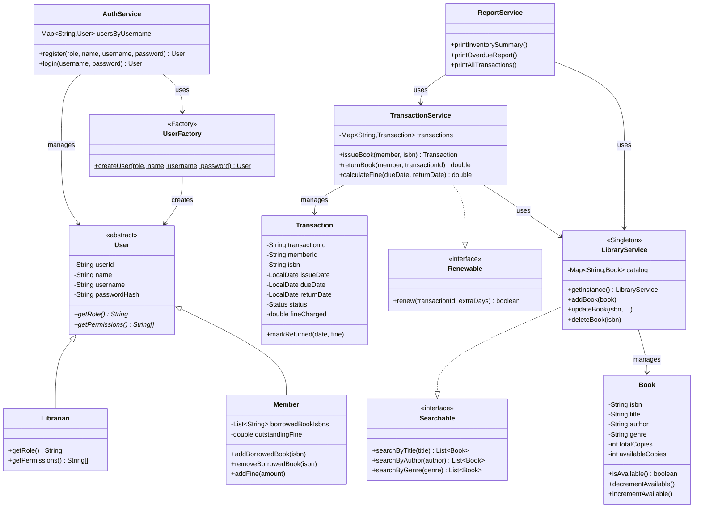

# Class Diagram

## Notes

- `User` is abstract; `Librarian` and `Member` provide concrete, polymorphic
  implementations of `getRole()` and `getPermissions()`.
- `LibraryService` is implemented as a **Singleton** — the whole application
  shares one catalog instance.
- `UserFactory` implements the **Factory** pattern, hiding the decision of
  whether to instantiate a `Librarian` or `Member`.
- `Searchable` and `Renewable` are interfaces that decouple *what* a service
  can do from *how* it does it.
