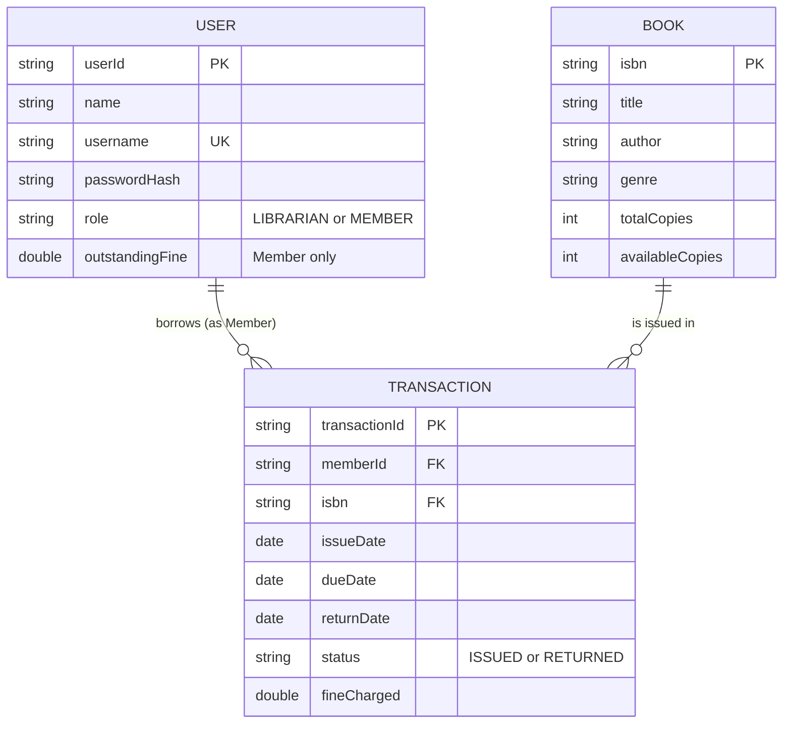

# Data / Storage Design

This project uses **Java object serialization** to flat files rather than a
relational database, so there is no live schema enforcement. The diagram
below documents the *logical* entity relationships and field-level schema
that the serialized objects follow — useful if this project were later
migrated to a relational database.

## ER Diagram

## Schema / File Design

| Logical Table | File | Format |
|---|---|---|
| `users` | `data/users.dat` | Serialized `List<User>` (polymorphic: `Librarian` / `Member`) |
| `books` | `data/books.dat` | Serialized `List<Book>` |
| `transactions` | `data/transactions.dat` | Serialized `List<Transaction>` |
| `logs` | `data/application.log` | Plain text, append-only |

### Relationships
- One `USER` (Member) can have many `TRANSACTION` records (1-to-many).
- One `BOOK` can appear in many `TRANSACTION` records over time (1-to-many).
- `TRANSACTION.memberId` and `TRANSACTION.isbn` act as foreign keys back to
  `USER` and `BOOK` respectively.
