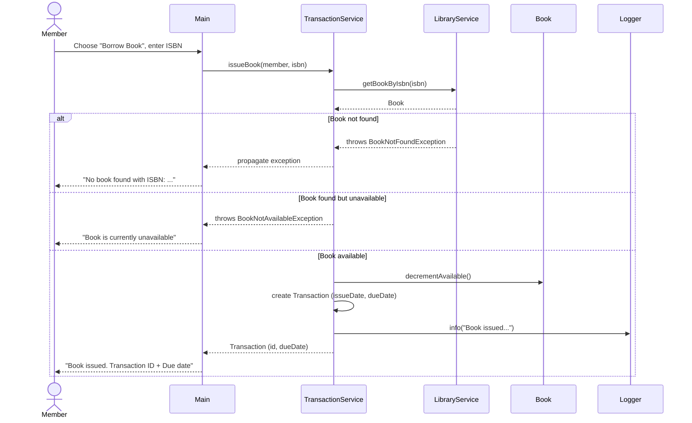
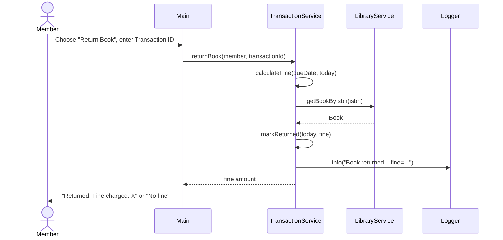

# Sequence Diagram — Borrow Book Flow

```mermaid
sequenceDiagram
    actor M as Member
    participant Main
    participant TS as TransactionService
    participant LS as LibraryService
    participant B as Book
    participant Log as Logger

    M->>Main: Choose "Borrow Book", enter ISBN
    Main->>TS: issueBook(member, isbn)
    TS->>LS: getBookByIsbn(isbn)
    LS-->>TS: Book

    alt Book not found
        LS-->>TS: throws BookNotFoundException
        TS-->>Main: propagate exception
        Main-->>M: "No book found with ISBN: ..."
    else Book found but unavailable
        TS-->>Main: throws BookNotAvailableException
        Main-->>M: "Book is currently unavailable"
    else Book available
        TS->>B: decrementAvailable()
        TS->>TS: create Transaction (issueDate, dueDate)
        TS->>Log: info("Book issued...")
        TS-->>Main: Transaction (id, dueDate)
        Main-->>M: "Book issued. Transaction ID + Due date"
    end
```

## Sequence Diagram — Return Book Flow

```mermaid
sequenceDiagram
    actor M as Member
    participant Main
    participant TS as TransactionService
    participant LS as LibraryService
    participant Log as Logger

    M->>Main: Choose "Return Book", enter Transaction ID
    Main->>TS: returnBook(member, transactionId)
    TS->>TS: calculateFine(dueDate, today)
    TS->>LS: getBookByIsbn(isbn)
    LS-->>TS: Book
    TS->>TS: markReturned(today, fine)
    TS->>Log: info("Book returned... fine=...")
    TS-->>Main: fine amount
    Main-->>M: "Returned. Fine charged: X" or "No fine"
```
