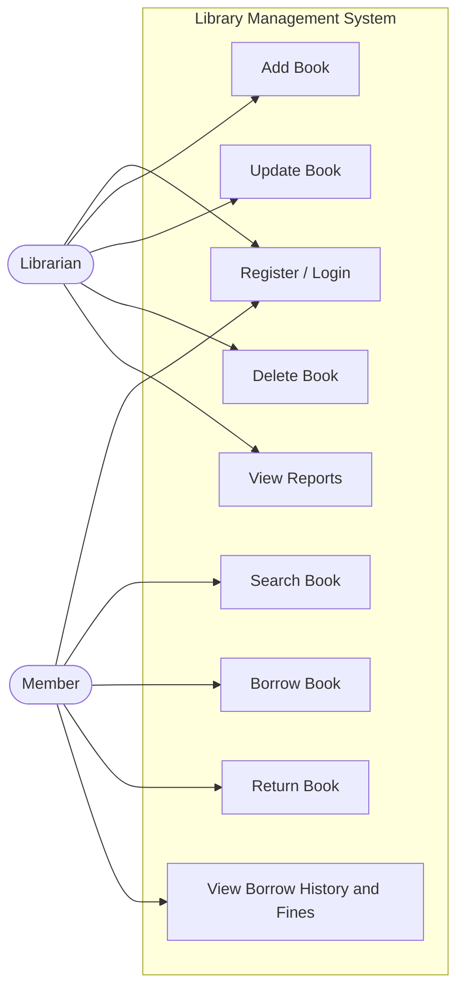

# Use Case Diagram

## Description

| Actor | Use Cases |
|---|---|
| **Librarian** | Register/Login, Add Book, Update Book, Delete Book, View Reports (inventory, overdue, all transactions) |
| **Member** | Register/Login, Search Book, Borrow Book, Return Book, View Borrow History & Fines |

Both actors share the **Register/Login** use case, which is handled by
`AuthService` and routes each user to a role-specific menu based on the
polymorphic `getRole()` result.
