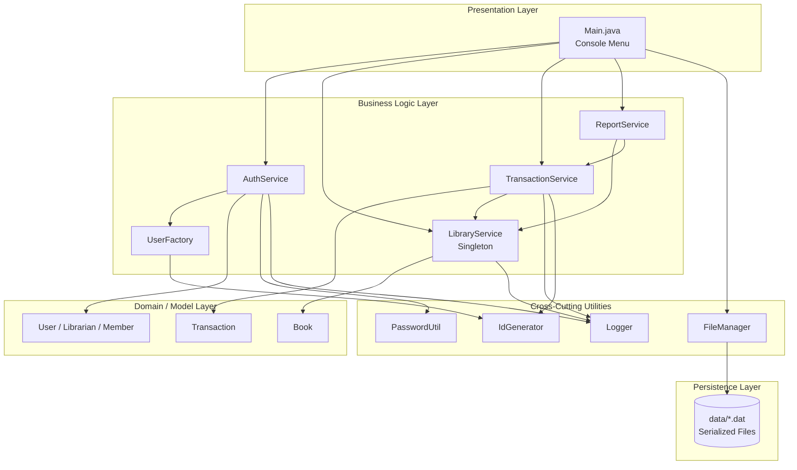
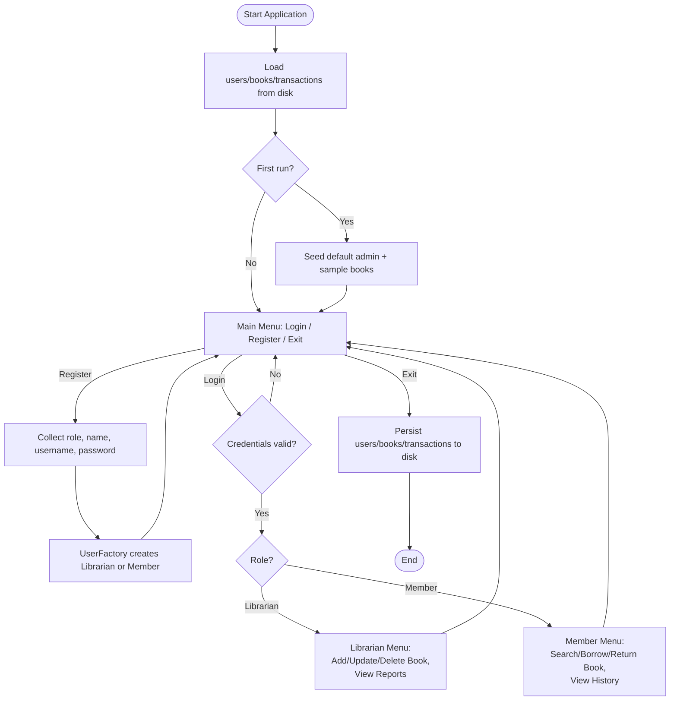

# System Architecture & Workflow

## Architecture Diagram

```mermaid
flowchart TB
    subgraph Presentation["Presentation Layer"]
        Main[Main.java<br/>Console Menu]
    end

    subgraph BusinessLogic["Business Logic Layer"]
        Auth[AuthService]
        Lib[LibraryService<br/>Singleton]
        Txn[TransactionService]
        Rep[ReportService]
        Fac[UserFactory]
    end

    subgraph Domain["Domain / Model Layer"]
        User[User / Librarian / Member]
        Book[Book]
        Transaction[Transaction]
    end

    subgraph CrossCutting["Cross-Cutting Utilities"]
        Log[Logger]
        Pwd[PasswordUtil]
        FileMgr[FileManager]
        IdGen[IdGenerator]
    end

    subgraph Persistence["Persistence Layer"]
        Data[(data/*.dat<br/>Serialized Files)]
    end

    Main --> Auth
    Main --> Lib
    Main --> Txn
    Main --> Rep

    Auth --> Fac
    Auth --> User
    Auth --> Pwd
    Lib --> Book
    Txn --> Transaction
    Txn --> Lib
    Rep --> Lib
    Rep --> Txn

    Auth --> Log
    Lib --> Log
    Txn --> Log

    Main --> FileMgr
    FileMgr --> Data
    Fac --> IdGen
    Txn --> IdGen
```

## Process / Workflow Diagram

```mermaid
flowchart TD
    Start([Start Application]) --> Load[Load users/books/transactions from disk]
    Load --> Seed{First run?}
    Seed -- Yes --> SeedData[Seed default admin + sample books]
    Seed -- No --> Menu
    SeedData --> Menu[Main Menu: Login / Register / Exit]

    Menu -- Register --> RegisterFlow[Collect role, name, username, password]
    RegisterFlow --> CreateUser[UserFactory creates Librarian or Member]
    CreateUser --> Menu

    Menu -- Login --> AuthCheck{Credentials valid?}
    AuthCheck -- No --> Menu
    AuthCheck -- Yes --> RoleCheck{Role?}

    RoleCheck -- Librarian --> LibMenu[Librarian Menu:<br/>Add/Update/Delete Book,<br/>View Reports]
    RoleCheck -- Member --> MemMenu[Member Menu:<br/>Search/Borrow/Return Book,<br/>View History]

    LibMenu --> Menu
    MemMenu --> Menu

    Menu -- Exit --> Persist[Persist users/books/transactions to disk]
    Persist --> End([End])
```
